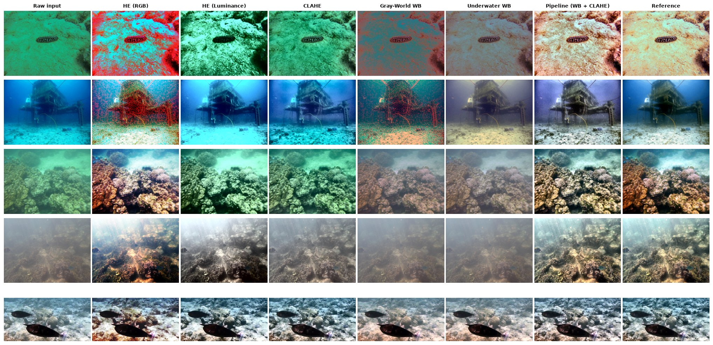

# Underwater Image Enhancement

A Python + OpenCV pipeline that corrects color distortion and low contrast in underwater images. It compares
CLAHE, white balance and histogram equalization on the public **UIEB** dataset, using PSNR, SSIM, UCIQE and UIQM.



| Method (100 UIEB images) | PSNR ↑ | SSIM ↑ | UCIQE ↑ | UIQM ↑ |
|---|---|---|---|---|
| Raw input | 17.69 | 0.774 | 0.259 | 2.409 |
| CLAHE | 17.95 | 0.821 | 0.291 | 2.744 |
| HE (RGB) | 16.72 | 0.792 | **0.356** | 2.813 |
| Underwater WB | 17.87 | 0.801 | 0.228 | 2.443 |
| **Pipeline (WB + CLAHE)** | **19.72** | **0.834** | 0.328 | **2.954** |

🌊 **Live demo:** _coming soon_  
📄 **Report:** [REPORT.pdf](REPORT.pdf)

## Quick start

```bash
python -m venv .venv && source .venv/bin/activate
pip install -r requirements.txt
python scripts/download_uieb.py --n 100   # UIEB subset (raw + reference), ~220 MB
python scripts/evaluate.py                # metrics CSVs + figures in results/
streamlit run app.py                      # web demo at http://localhost:8501
```

## Web app

`app.py` is a Streamlit app where you can:

* upload your own underwater photo (plus an optional ground truth) or pick a UIEB sample
* choose a method and tune its parameters live (red-compensation α, CLAHE clip limit and tile size, gamma, saturation)
* see before/after, per-channel histograms and metric deltas against the original
* compare all methods side by side with a metrics table
* download the enhanced image

## Project layout

```
uie/enhance.py           enhancement methods + combined pipeline
uie/metrics.py           PSNR, SSIM, UCIQE, UIQM
scripts/download_uieb.py reproducible UIEB subset download
scripts/evaluate.py      batch evaluation, CSVs, Matplotlib figures
app.py                   Streamlit web app
results/                 summary.csv, per_image_metrics.csv, win_rate_vs_raw.csv, figures/
scripts/experiments.py   ablation, sensitivity, Wilcoxon tests, report figures
report/report.typ        report source (Typst); scripts/build_report_pdf.py -> REPORT.pdf
Dockerfile               container image (any Docker host / HF Docker Space)
```

## Using the library

```python
import cv2
from uie import pipeline, uiqm

img = cv2.imread("dive.jpg")
out = pipeline(img, red_alpha=1.0, clip_limit=2.0)
print(uiqm(img), "->", uiqm(out))
cv2.imwrite("dive_enhanced.jpg", out)
```
