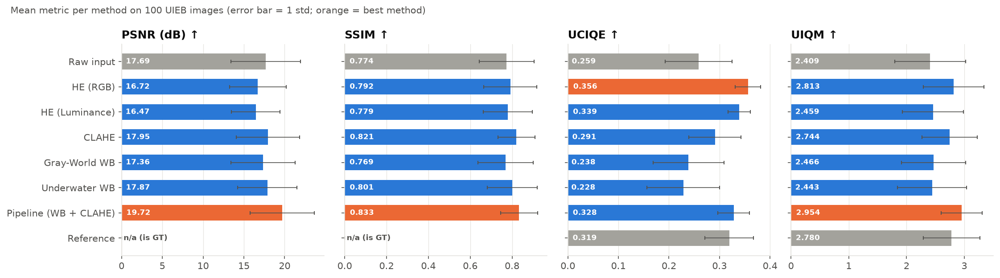
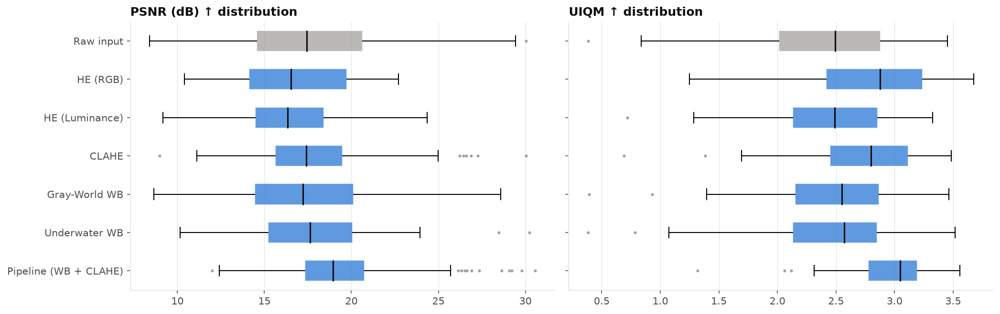
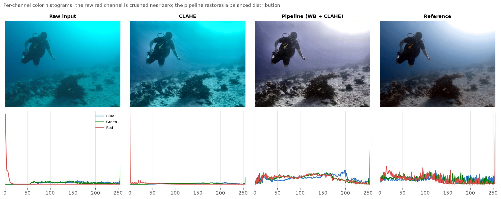

# Underwater Image Enhancement — Project Report

## 1. Problem

Underwater photographs suffer from two physical effects:

* **Wavelength-dependent absorption.** Water absorbs red light within a few metres, then orange and yellow.
  The red channel collapses, producing the familiar **blue/green color cast**.
* **Scattering** by suspended particles adds a veil of haze, which **lowers contrast** and washes out detail.

The goal of this project is a lightweight, classical (non-learning) image processing pipeline in Python + OpenCV
that corrects color distortion and low contrast, and a quantitative comparison of standard enhancement techniques.

## 2. Dataset

**UIEB — Underwater Image Enhancement Benchmark** (Li et al., *IEEE TIP* 2019). UIEB contains 890 real underwater
images, each paired with a **reference image** that volunteers picked as the best of 12 enhancement results.
These references make full-reference metrics (PSNR, SSIM) possible.

* A reproducible random subset of **100 image pairs** (seed 42) was used, fetched by `scripts/download_uieb.py`
  from the Hugging Face mirror `Edddddd8787/UIEB`.
* Images were downscaled so the longest side is at most 640 px before evaluation.

## 3. Methods

All methods are in `uie/enhance.py` and work on 8-bit BGR images.

| # | Method | Description | Targets |
|---|---|---|---|
| 1 | **HE (RGB)** | Global histogram equalization of each RGB channel independently | color + contrast |
| 2 | **HE (Luminance)** | Global histogram equalization of the Y channel (YCrCb) only | contrast |
| 3 | **CLAHE** | Contrast-Limited Adaptive HE on the L channel of CIELAB (clip 2.0, 8×8 tiles) | local contrast |
| 4 | **Gray-World WB** | Scale each channel so its mean equals the global mean | color |
| 5 | **Underwater WB** | Red-channel compensation (Ancuti et al., 2018), then Gray-World | color |
| 6 | **Pipeline (WB + CLAHE)** | Red compensation → Gray-World → 0.5 % percentile stretch → CLAHE on L | color + contrast |

**Red-channel compensation.** Plain Gray-World fails underwater: when the red mean is close to zero, the gain
becomes huge and amplifies noise into red artifacts. Ancuti et al. compensate the red channel using the
better-preserved green channel *before* white balancing:

$$I_r' = I_r + \alpha\,(\bar I_g - \bar I_r)\,(1 - I_r)\,I_g$$

The $(1 - I_r)\,I_g$ term adds red mostly where red is weak and green carries signal, so it avoids saturating
pixels that already have red.

**Why order matters in the pipeline.** Color correction comes first so that CLAHE, which only touches lightness,
sharpens an already-neutral image. Running CLAHE on all RGB channels instead would shift hues.

## 4. Evaluation metrics

Implemented in `uie/metrics.py`. **All metrics: higher is better.**

| Metric | Type | Measures |
|---|---|---|
| **PSNR** (dB) | full-reference | pixel-wise fidelity to the UIEB reference |
| **SSIM** | full-reference | structural / perceptual similarity to the reference |
| **UCIQE** (Yang & Sowmya, 2015) | no-reference | chroma std + luminance contrast + mean saturation |
| **UIQM** (Panetta et al., 2016) | no-reference | colorfulness (UICM) + sharpness (UISM) + contrast (UIConM) |

## 5. Results

### 5.1 Quantitative (mean ± std over 100 images)

| Method | PSNR ↑ | SSIM ↑ | UCIQE ↑ | UIQM ↑ | Time (ms) |
|---|---|---|---|---|---|
| Raw input | 17.69 ± 4.28 | 0.774 ± 0.130 | 0.259 ± 0.066 | 2.409 ± 0.615 | — |
| HE (RGB) | 16.72 ± 3.47 | 0.792 ± 0.127 | **0.356** ± 0.025 | 2.813 ± 0.525 | 1.1 |
| HE (Luminance) | 16.47 ± 2.99 | 0.779 ± 0.117 | 0.338 ± 0.022 | 2.459 ± 0.530 | 1.0 |
| CLAHE | 17.95 ± 3.86 | 0.821 ± 0.089 | 0.291 ± 0.052 | 2.744 ± 0.479 | 1.4 |
| Gray-World WB | 17.36 ± 3.94 | 0.769 ± 0.132 | 0.238 ± 0.070 | 2.466 ± 0.556 | 4.1 |
| Underwater WB | 17.87 ± 3.66 | 0.801 ± 0.120 | 0.228 ± 0.072 | 2.443 ± 0.599 | 6.2 |
| **Pipeline (WB + CLAHE)** | **19.72** ± 3.93 | **0.834** ± 0.088 | 0.328 ± 0.031 | **2.954** ± 0.357 | 12.3 |
| *Reference (ground truth)* | — | — | 0.319 ± 0.048 | 2.780 ± 0.491 | — |

Times are per 640 px image on an Apple Silicon laptop, single-threaded Python/OpenCV.



**Win rate:** the share of images on which a method scores higher than the raw input.

| Method | PSNR | SSIM | UCIQE | UIQM |
|---|---|---|---|---|
| HE (RGB) | 42 % | 46 % | 98 % | 96 % |
| HE (Luminance) | 43 % | 49 % | 97 % | 47 % |
| CLAHE | 59 % | 64 % | 91 % | 89 % |
| Gray-World WB | 55 % | 52 % | 9 % | 61 % |
| Underwater WB | 61 % | 64 % | 4 % | 51 % |
| **Pipeline** | **69 %** | 61 % | 94 % | **96 %** |



### 5.2 Visual comparison

Five test images, ordered from most to less degraded (by raw PSNR):


### 5.3 Color histograms



In the raw image the red channel is crushed near zero. CLAHE stretches lightness but leaves red missing.
The pipeline spreads all three channels over the full range, so the histograms look like the reference's.

## 6. Discussion

1. **The combined pipeline is the best overall.** It ranks first on PSNR (+2.0 dB over raw), SSIM and UIQM,
   and it has the smallest spread in UIQM (std 0.36), so it is the most consistent. It is the only method that
   fixes color and contrast together, which matches the two physical causes in Section 1.
2. **Single techniques fix only half the problem.** CLAHE improves contrast and structure (SSIM 0.821) but keeps
   the cast. White balance alone fixes color but keeps the haze, so its no-reference scores barely move.
3. **Red compensation matters.** Gray-World on its own *lowers* SSIM on average (0.769 < 0.774 raw) because it
   over-amplifies the near-empty red channel (see the red/cyan noise in the grid, row 2). Adding Ancuti's
   compensation step raises SSIM to 0.801 and PSNR by 0.5 dB.
4. **Global HE (RGB) gets the highest UCIQE but the worst fidelity.** It forces every channel to a flat histogram,
   which gives saturated, high-contrast output — exactly what UCIQE rewards — but with false colors and amplified
   noise (row 1 of the grid turns red/cyan). PSNR drops 1 dB below the raw input.
5. **No-reference metrics must be read with care.** HE (RGB), HE (Luminance) and the pipeline all score *above the
   human-chosen reference* on UCIQE, and the pipeline beats it on UIQM. These metrics reward colorfulness and
   contrast; they don't penalize overshoot. That is why full-reference metrics and visual inspection were used
   alongside them.

## 7. Limitations and future work

* The pipeline uses global white balance. Scenes with strong depth variation would benefit from a
  physics-based model (e.g. dark channel prior / underwater light attenuation).
* Strong haze is not explicitly removed. A dehazing step or multi-scale fusion (Ancuti et al., 2018) is the
  natural next step.
* Parameters (α, clip limit) are fixed. Adapting them per image, for example from the raw red-channel mean,
  could reduce the over-correction visible on already-well-exposed images.
* Deep models (Water-Net, Ushape-Transformer) would score higher on UIEB but need training data and a GPU.
  This project focuses on fast, interpretable methods that run in ~12 ms per image on CPU.

## 8. Reproduce

```bash
python -m venv .venv && source .venv/bin/activate
pip install -r requirements.txt
python scripts/download_uieb.py --n 100     # ~220 MB
python scripts/evaluate.py                  # writes results/*.csv and results/figures/*
streamlit run app.py                        # interactive demo
```

## References

* C. Li et al., "An Underwater Image Enhancement Benchmark Dataset and Beyond," *IEEE TIP*, 2019. (UIEB)
* C. O. Ancuti et al., "Color Balance and Fusion for Underwater Image Enhancement," *IEEE TIP*, 2018.
* K. Zuiderveld, "Contrast Limited Adaptive Histogram Equalization," *Graphics Gems IV*, 1994.
* M. Yang and A. Sowmya, "An Underwater Color Image Quality Evaluation Metric," *IEEE TIP*, 2015. (UCIQE)
* K. Panetta et al., "Human-Visual-System-Inspired Underwater Image Quality Measures," *IEEE JOE*, 2016. (UIQM)
